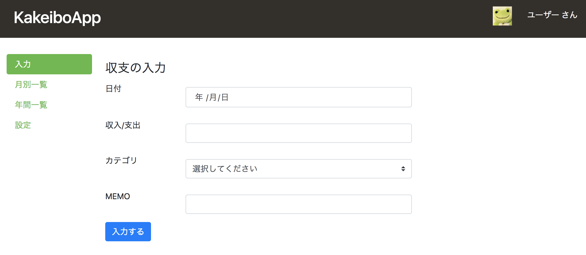

# Kakeibo

This application can record your income and outgo.("Kakeibo" in Japanese.)

### Language and tools
* Programming Language
    * Java (Backend)
    * HTML, CSS, JavaScript (Frontend)
* FrameWork 
    * SpringBoot
* Build Tool
    * Gradle
* Database
    * MySQL
    
### Setup
* Install MySQL in your computer
* Create database named "kakeibo" and user who have all grant on "kakeibo"
* Modify src/main/resources/application.properties
    * Replace `[username]` and `[password]` on another user information you created
```
spring.jpa.hibernate.ddl-auto=update
spring.datasource.url=jdbc:mysql://localhost:3306/kakeibo
spring.datasource.username=[username]
spring.datasource.password=[password]
```

### How to run application in development environment
* Run below command at current directory
```
./gradlew BootRun
```
* Access below URL
    * http://localhost:8080/income_outgo/new
    


